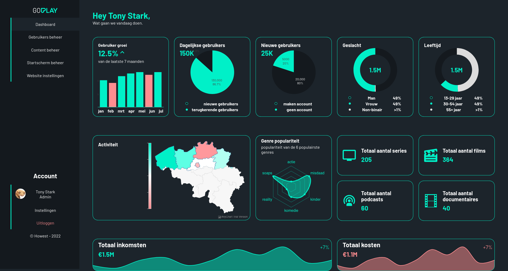

<section class="c-project__about">

For our last class we were tasked to make groups of 4 and work on a scrum project. For my group that project was a dashboard for the backend for the site [Goplay](https://www.goplay.be/) (their brand style was different at the time of creating this project) where each person had a different role.

I was git master which meant I was in charge of merging branches and fixing any conflicts there were. I also had to fill in the role of scrum master a couple of times since the person assigned to it was sick for a couple of days. Each of us had a different part of the site to work on, I decided I would create the homepage and later on we were tasked to create a couple extra pages and I got the settings page.

While working on the homepage I had to create the graphs we created in our design and for that I decided to test around a bit with a couple of different JavaScript libraries to create them. I eventually settled on using multiple libraries for different charts since they each had a part in which they were stronger. I also made the setup for the gulp project and how to layout our .scss files.

I had a lot of fun creating this project and learned a lot of working in a team. The most important part was, in my opinion, helping each other with our parts and looking for solutions to problems each of us had.

</section>

<section class="c-project__tech">

## Tech used

- HTML5
- SCSS
- JavaScript
- JavaScript libraries
  - [Plotly.js](https://plotly.com/javascript/)
  - [anychart.js](https://www.anychart.com/)
  - [chart.js](https://www.chartjs.org/)
- [gulp](https://gulpjs.com/)

</section>

<section class="c-project__image">

</section>
