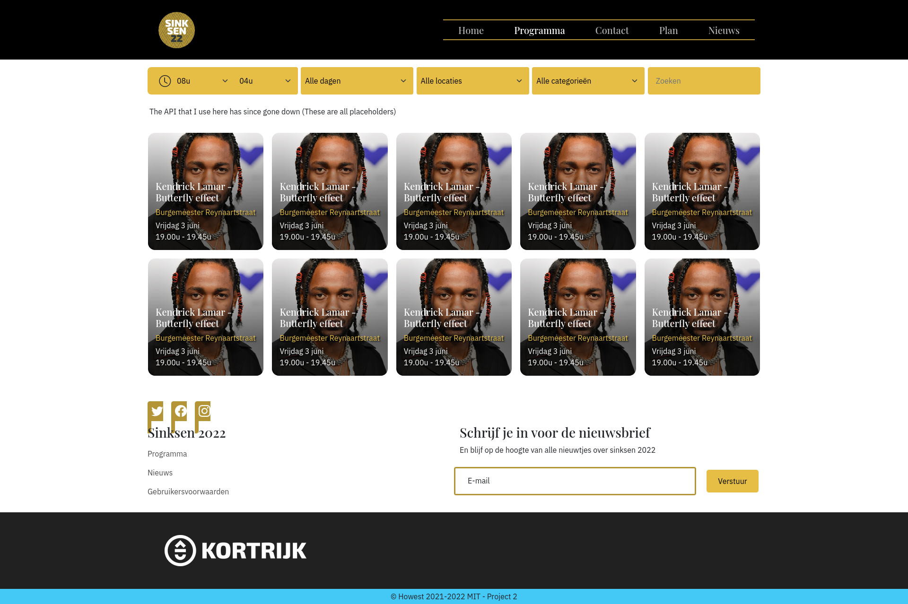

<section class="c-project__about">

For our first big project of the degree we had to create a website and promotional video for [Sinksen](https://www.sinksen.be/) for the year 2022.

The first part was obviously designing the entire project. Since the theme that year was 'art deco' we had to create a website that fit with that style and still feel modern.

After the design was done it was time to start building the website. We were also given an api where it we needed to get all the different activities from and have the ability to like them. We also had to create a leaflet map where you would be able to see the different points where things were happening (This api has since gone offline).

Since I was following the video track of my degree I also had to go and film on Sinksen itself and then create a video. Our entire class had to share footage because it was quite impossible to go and film every location by yourself and gather enough interesting footage.

We had to do the editing of the video in Premiere pro and then also use copyright free music.

This project had the first big video with both a lot of freedom and restrictions in it and I learned a lot from that. Also working with an expansive api for the first time was a fun experience and really cemented how to perform proper CRUD operations.

</section>

<section class="c-project__tech">

## Tech used

- HTML5
- SCSS
- JavaScript
- JavaScript libraries
  - [Leaflet](https://leafletjs.com/)
- Premiere Pro
- Adobe XD
- Filming

</section>

<section class="c-project__image">

</section>
