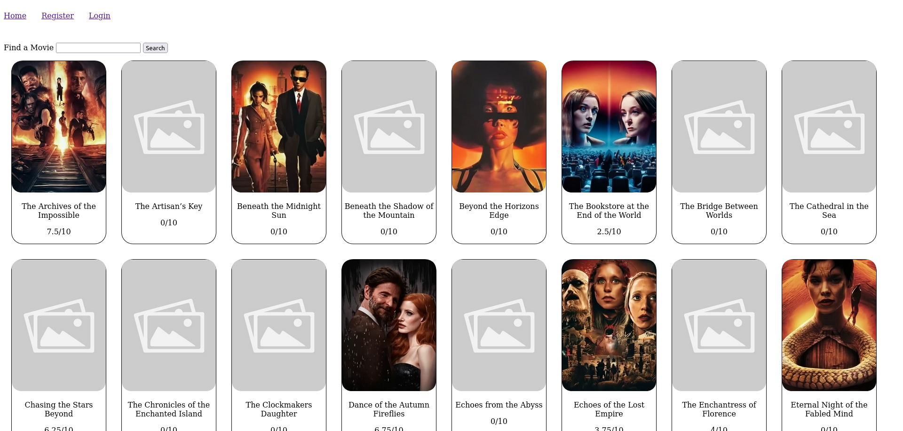

<section class="c-project__about">

This is my very first full fledged PHP site. Since this was meant as a test to assess that I am able to create a functional site in PHP and keep the code readable for my course at the VDAB.

I created the site according to the MVC design pattern and had to use MySQL for the database. I started with creating the database and filled in the data with chatGPT. While creating the database I decided to Use paths and locally stored images for the film posters but when it came to the images of actors and directors I wanted a bit of a challenge since these were optional in my description of the task so I saved them as blobs in the database.

I had a couple of problems while reading the blobs from the database and setting them in img tags and also while saving images. Since this site was meant to have all basic CRUD operations Admins had both the ability to create and edit films and actors/directors, while users only could create a list for which movies they wanted to watch / have watched and give them scores.

My biggest problem came when I wanted to put the site online since I decided to use vercel since it's a free platform with little restrictions for simple sites. As I put the site online I had to deal with routes for the first time and those caused me a lot of headaches since there isn't a lot of proper documentation on hosting a PHP site on vercel. After figuring it out i had to translate a lot of the sql script for the database since I used a lot of things which caused errors in PostgreSQL.

</section>

<section class="c-project__tech">

## Tech used

- PHP
- Twig
- SQL
- MySQL
- PostgreSQL
- CSS
- JS

</section>

<section class="c-project__image">

</section>
